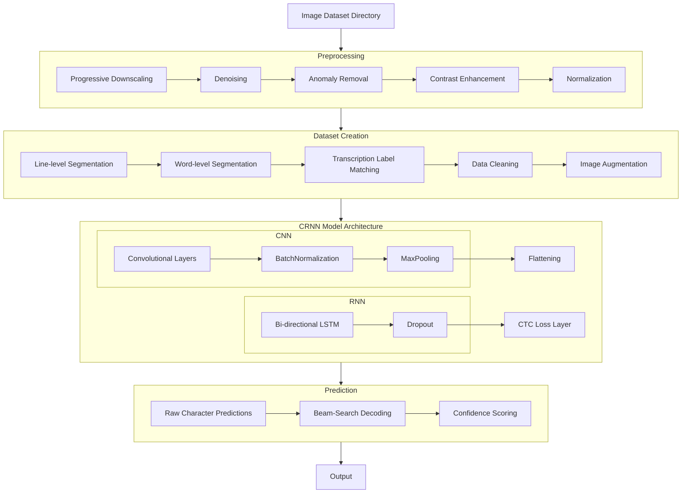
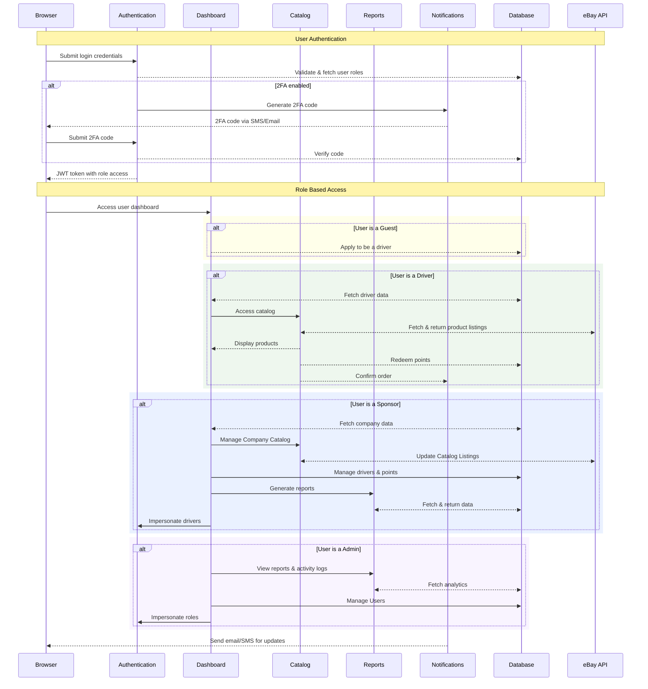
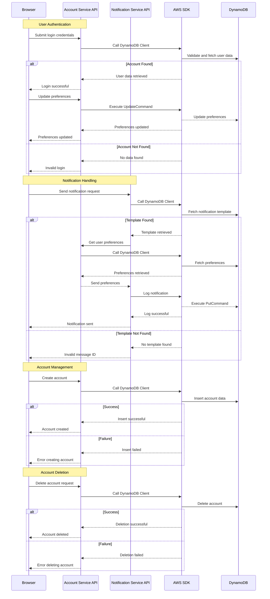
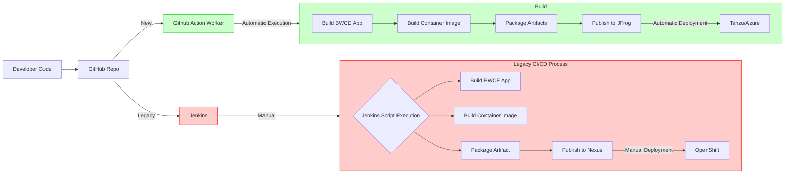
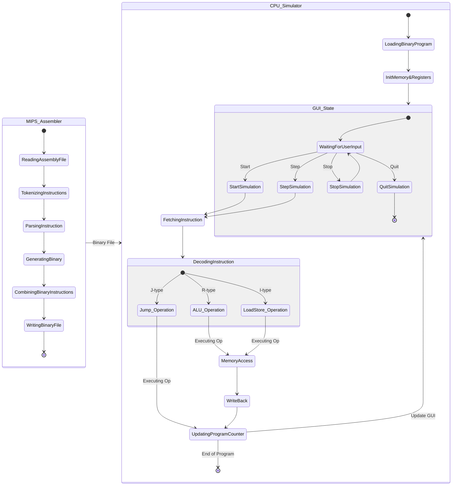
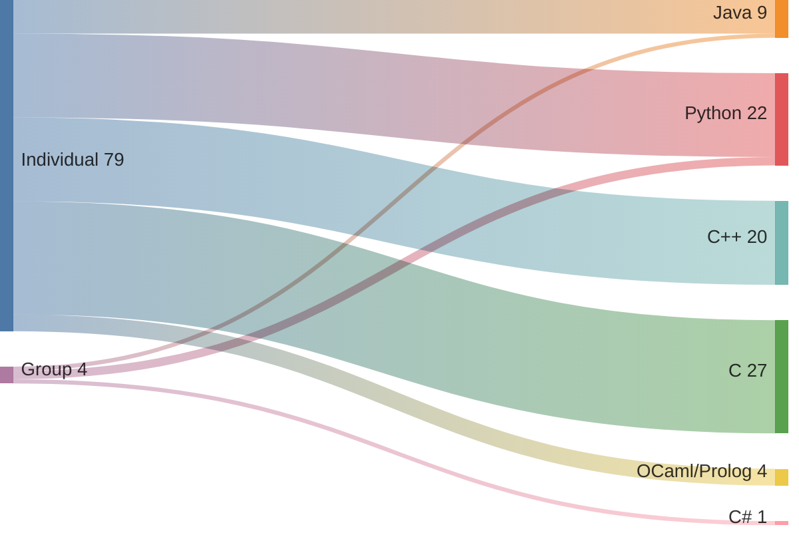

# College Projects <!-- omit in toc -->

Welcome to my portfolio of projects! This repository catalogs my coding journey throughout my college experience, with links to my publicly available work. For transparency, it also includes descriptions of private or group projects that currently cannot be shared publicly. 

These projects span various programming languages and demonstrate my skills in areas such as algorithms, system development, application design, and data analysis.

# Table of Contents <!-- omit in toc -->
- [Languages Included](#languages-included)
- [Notable Projects](#notable-projects)
  - [Cursive OCR Pipeline (Python)](#cursive-ocr-pipeline-python)
  - [Driver Incentive Web App (C#)](#driver-incentive-web-app-c)
  - [Serverless Account API (Node.js)](#serverless-account-api-nodejs)
  - [DevOps Migration CI/CD Pipeline (Kubernetes/Github Actions)](#devops-migration-cicd-pipeline-kubernetesgithub-actions)
  - [Mips Assembler \& CPU Simulator (C++ \& Java)](#mips-assembler--cpu-simulator-c--java)
- [Project Overview and Progression](#project-overview-and-progression)
- [Project Stats For Data Nerds](#project-stats-for-data-nerds)

## Languages Included
Most of my projects are backend-heavy, and therefore are categorized by their respective backend language, but my more comprehensive projects also include frontend language implementation.
- [Java](./Java)
- [Python](./Python)
- [C#](./C#)
- [C++](./C++)
- [C](./C)
- [Ocaml/Prolog](./Ocaml)
  
## Notable Projects

### Cursive OCR Pipeline (Python)

   - **Overview**: A cursive handwriting recognition AI for historical documents.
   - **Tech Stack**: Python, TensorFlow, OpenCV, Matplotlib, Keras, Pandas
   - **Link**: Currently private, reach out to me for further details!
   - **Skills Demonstrated**: Image preprocessing, Data cleaning, AI, machine learning, and text extraction.
   - **Features**:
     - Custom image preprocessing pipeline
       - progressive downscaling
       - denoising
       - anomaly removal
       - contrast enhancement
       - normalization
     - Custom image segmentation and labeling pipeline 
       - Line level image segmentation with horizontal projection profiling
       - Word level image segmentation with vertical projection profiling
       - Transcription label matching
       - Data cleaning
       - Image augmentation for expanding the small training dataset
     - CRNN model architecture
       - CNN for feature extraction
       - RNN for sequential information processing
       - CTC loss for end-to-end training
     - Data visualization
       - Dataset analytics
       - Model performance and accuracy metrics
       - Segmentation and prediction overlays for debugging and analysis
### Driver Incentive Web App (C#)

   - **Overview**: An enterprise-level web application for managing driver incentives and rewards, designed with a multi-tier architecture pattern with RESTful APIs, authentication services, and real-time reporting.
   - **Tech Stack**: C#, .NET Core, AWS, MySQL, Typescript, Nginx, Certbot, 
   - **Link**: [Driver Incentive Web App](./C#/DriverIncentive)
   - **Skills Demonstrated**: Full-stack development, cloud infrastructure management, API design, database operations, and accessibility compliance.
  
   - **Features**:
     - Points Management with real-time tracking, allocation, and redemption of driver reward points
     - Accessibility Compliance
       -  Screen reader support
       -  keyboard navigation
       -  accessible color profile themes
       -  light/dark mode
     - Website security 
       - 2FA with email and SMS verification
       - JWT-based authentication with claims-based authorization
       - SSL Encryption
       - Audit logging for all system operations
       - Automated AWS S3 database backups
     - Responsive design for mobile and desktop users
     - Account management and user preferences
     - Real-time dashboards with analytics and data visualization components
     - Dynamic product catalog with eBay API integration
     - Multi-tenant architecture with role-based access for administrators, sponsors, and drivers
     - Comprehensive reporting with PDF and CSV export capabilities
     - Automated database migrations, notifications, and real-time updates.

### Serverless Account API (Node.js)

   - **Overview**: A serverless backend using AWS SDK for managing user accounts and notifications. It includes account creation, preference updates, login, and notification handling based on user preferences stored in DynamoDB.
   - **Tech Stack**: Node.js, AWS Lambda, AWS DynamoDB, AWS SDK
   - **Link**: Currently private
   - **Skills Demonstrated**: Serverless architecture, AWS SDK usage, REST API development, error handling, and notification systems.
   - **Features**:
   - Integrated AWS SDK for DynamoDB with asynchronous commands for data handling.
   - Account management with endpoints for CRUD requests
   - Secure login using email and password, with guest access for limited features.
   - Dynamic notifications via email or SMS based on user preferences.
   - Comprehensive error handling with custom messages for invalid requests.
   - Detailed OpenAPI documentation for all endpoints.

### DevOps Migration CI/CD Pipeline (Kubernetes/Github Actions)

   - **Overview**: A CI/CD pipeline for cloud migration of Tibco BWCE Apps from OpenShift & Jenkins to Tanzu & Azure with support for JFrog Artifactory migration from Nexus.
   - **Tech Stack**: Kubernetes, GitHub Actions, Jenkins, Azure, JFrog Artifactory, Openshift, Tanzu
   - **Link**: This project was completed during a Co-Op assignment and is not available for external viewing.
   - **Skills Demonstrated**: cloud migration, container orchestration, and CI/CD pipeline design.
   - **Features**:
     - Simplified, scalable interface through github actions
     - Template-style architecture 
     - Base level code uses kuberenetes standards for maximum cloud integration potential.

### Mips Assembler & CPU Simulator (C++ & Java)

   - **Overview**: A two-part project consisting of a MIPS Assembler in C++ and an interactive CPU Pipeline Simulator in Java. The assembler translates MIPS assembly language instructions into 32-bit machine code, which is then executed by the CPU simulator. The simulator supports instruction cycle tracking, memory reads/writes, and ALU operations.
   - **Tech Stack**: C++, Java, JavaFX, SceneBuilder, Maven
   - **Link**: Currently private
   - **Skills Demonstrated**: System-level programming, MVC architecture, and simulation design
   - **Features**:
     - MIPS Assembler:
       - Supports R-type, I-type, and J-type instructions.
     - CPU Simulator:
       - Supports single-step and full-cycle execution modes.
       - Implements an observer pattern for real-time view updates.
       - Tracks detailed ALU and memory operations.
       - GUI with JavaFX for interactive simulation.

## Project Overview and Progression

This repository reflects my progression in coding skills across various domains:
- **Early Projects**: Focused on fundamental programming concepts and small-scale applications.
- **Intermediate Projects**: Applied object-oriented principles, data structures, and algorithms to more complex problems.
- **Advanced Projects**: Explored system-level programming, machine learning, and distributed systems.

## Project Stats For Data Nerds

**Project Distribution By Language**
